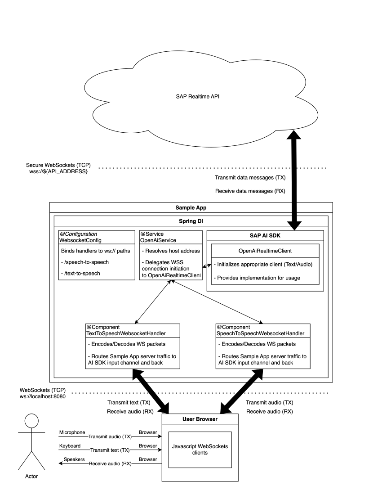

## Introduction

This guide demonstrates how to use the SAP AI SDK for Java to interact with the OpenAI Realtime API deployed on SAP AI Core.
The Realtime API enables low-latency, full-duplex audio conversations with a model.

> [!WARNING]
> The Realtime API client is in **Beta** and subject to breaking changes in any release.

## Prerequisites

Before using the AI Core module, ensure that you have met all the general requirements outlined in the [overview](../../overview-cloud-sdk-for-ai-java#general-requirements).
Additionally, include the necessary Maven dependency in your project.

### Maven Dependencies

```xml
<dependencies>
    <dependency>
        <groupId>com.sap.ai.sdk.foundationmodels</groupId>
        <artifactId>openai</artifactId>
        <version>${ai-sdk.version}</version>
    </dependency>
</dependencies>
```

## Usage

In addition to the prerequisites above, ensure you have a `gpt-realtime` model deployed in SAP AI Core before running the examples below.
We assume you have already set up the following to carry out the examples in this guide:

<!-- prettier-ignore-start-->

- **A Deployed OpenAI Model in SAP AI Core**

  - Refer
    to [How to deploy a model to AI Core](https://help.sap.com/docs/sap-ai-core/sap-ai-core-service-guide/create-deployment-for-generative-ai-model-in-sap-ai-core)
    for setup instructions.
  - In case the model is deployed in a custom resource group, refer to [this section](#using-a-custom-resource-group).
  - <details>
    <summary>Example deployed model from the AI Core <code>/deployments</code> endpoint</summary>

    ```json
    {
      "id": "d123456abcdefg",
      "deploymentUrl": "wss://realtime.ai.region.aws.ml.hana.ondemand.com/v2/inference/deployments/d123456abcdefg",
      "configurationId": "12345-123-123-123-123456abcdefg",
      "configurationName": "gpt-realtime",
      "scenarioId": "foundation-models",
      "status": "RUNNING",
      "statusMessage": null,
      "targetStatus": "RUNNING",
      "lastOperation": "CREATE",
      "latestRunningConfigurationId": "12345-123-123-123-123456abcdefg",
      "ttl": null,
      "details": {
        "scaling": {
          "backendDetails": {}
        },
        "resources": {
          "backendDetails": {
            "model": {
              "name": "gpt-realtime",
              "version": "latest"
            }
          }
        }
      },
      "createdAt": "2024-07-03T12:44:22Z",
      "modifiedAt": "2024-07-16T12:44:19Z",
      "submissionTime": "2024-07-03T12:44:51Z",
      "startTime": "2024-07-03T12:45:56Z",
      "completionTime": null
    }
    ```

    </details>

<!-- prettier-ignore-end-->

## Text to Speech

Send text, receive audio back as raw PCM bytes (mono, 24 000 Hz, 16-bit little-endian).

```java
AudioOutputChannel audioOutput = (pcmBytes, isLast) -> {
    // write pcmBytes to your audio sink; isLast signals end of utterance
};

try (TextInputChannel channel = OpenAiClient.realtimeClient().textToSpeech(audioOutput)) {
    channel.sendText("Hello, how are you today?");
    channel.sendText("Tell me a short joke.");
} // connection closes automatically
```

Please see the [Spring Boot sample application](https://github.com/SAP/ai-sdk-java/tree/main/sample-code/spring-app) for a complete example that bridges a browser WebSocket connection to the OpenAI Realtime API.

## Speech to Speech

Stream microphone input as PCM audio chunks and receive the model's audio response in real-time.

```java
AudioOutputChannel audioOutput = (pcmBytes, isLast) -> {
    // play pcmBytes through speakers; isLast signals end of utterance
};

try (AudioInputChannel channel = OpenAiClient.realtimeClient().speechToSpeech(audioOutput)) {
    // call inputAudio() repeatedly as microphone data arrives
    channel.inputAudio(pcmChunk);
} // connection closes automatically
```

The audio format for both input and output is **raw PCM, mono, 24 000 Hz, 16-bit little-endian**.

Please see the [Spring Boot sample application](https://github.com/SAP/ai-sdk-java/tree/main/sample-code/spring-app) for a complete example that bridges a browser WebSocket connection to the OpenAI Realtime API.

## Optional Parameters

Both `textToSpeech` and `speechToSpeech` accept optional `RealtimeParam` arguments to customise the session.

### Voice

Choose between two standard voices:

```java
// Voice 1 (Echo)
TextInputChannel channel = OpenAiClient.realtimeClient()
    .textToSpeech(audioOutput, RealtimeParamVoice.DEFAULT_1);

// Voice 2 (Marin, default)
TextInputChannel channel = OpenAiClient.realtimeClient()
    .textToSpeech(audioOutput, RealtimeParamVoice.DEFAULT_2);

// Custom voice name (unsafe – the SDK cannot validate the name at compile time)
TextInputChannel channel = OpenAiClient.realtimeClient()
    .textToSpeech(audioOutput, RealtimeParamVoice.unsafeWithExplicitVoice("shimmer"));
```

Please see the [Spring Boot sample application](https://github.com/SAP/ai-sdk-java/tree/main/sample-code/spring-app) for a complete example that bridges a browser WebSocket connection to the OpenAI Realtime API.

### Turn Detection

Control when the model decides to respond:

```java
// Model detects turn boundaries automatically (default for speechToSpeech)
AudioInputChannel channel = OpenAiClient.realtimeClient()
    .speechToSpeech(audioOutput, RealtimeParamTurnDetection.BY_MODEL_AUTO);

// Every inputAudio() call is treated as a complete turn (lower latency)
AudioInputChannel channel = OpenAiClient.realtimeClient()
    .speechToSpeech(audioOutput, RealtimeParamTurnDetection.EACH_CALL_IS_A_TURN);
```

Please see the [Spring Boot sample application](https://github.com/SAP/ai-sdk-java/tree/main/sample-code/spring-app) for a complete example that bridges a browser WebSocket connection to the OpenAI Realtime API.

### System Prompt

Override the default system prompt:

```java
TextInputChannel channel = OpenAiClient.realtimeClient()
    .textToSpeech(audioOutput, new RealtimeParamSystemPrompt("You are a helpful assistant."));
```

Please see the [Spring Boot sample application](https://github.com/SAP/ai-sdk-java/tree/main/sample-code/spring-app) for a complete example that bridges a browser WebSocket connection to the OpenAI Realtime API.

### Combining Parameters

Pass multiple params in any order:

```java
AudioInputChannel channel = OpenAiClient.realtimeClient()
    .speechToSpeech(
        audioOutput,
        RealtimeParamVoice.DEFAULT_1,
        RealtimeParamTurnDetection.EACH_CALL_IS_A_TURN,
        new RealtimeParamSystemPrompt("You are a concise assistant."));
```

Please see the [Spring Boot sample application](https://github.com/SAP/ai-sdk-java/tree/main/sample-code/spring-app) for a complete example that bridges a browser WebSocket connection to the OpenAI Realtime API.

## Custom Destination

To target a specific resource group or deployment, provide a custom destination directly:

```java
var destination = new AiCoreService()
    .getInferenceDestination("custom-rg")
    .forModel(GPT_REALTIME);

OpenAiRealtimeClient client = new OpenAiRealtimeClient(destination);
try (TextInputChannel channel = client.textToSpeech(audioOutput)) {
    channel.sendText("Hello!");
}
```

## Sample Application

Please see the [Spring Boot sample application](https://github.com/SAP/ai-sdk-java/tree/main/sample-code/spring-app) for a complete example that bridges a browser WebSocket connection to the OpenAI Realtime API.


