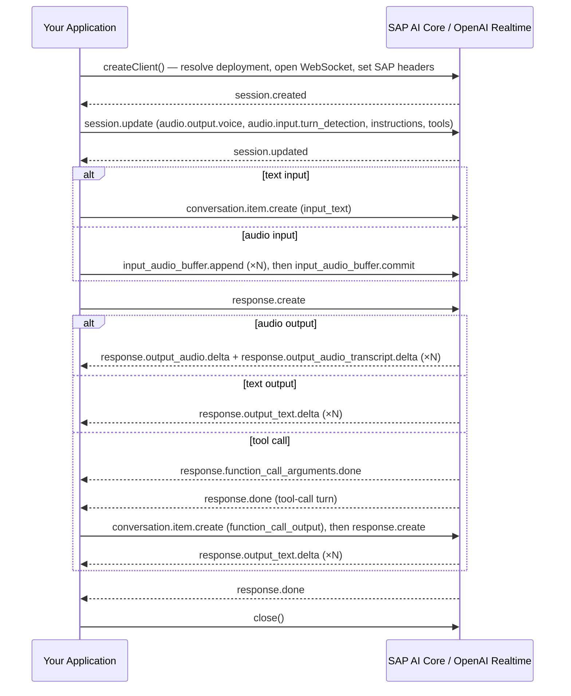

:::caution
The Realtime API client is experimental and may change at any time without prior notice.

Only WebSocket connections are supported.
Browser environments are not supported.
:::

`SapOpenAiRealtimeWs` connects to the OpenAI Realtime API over WebSocket, pre-configured for SAP AI Core.
It resolves the deployment, opens the WebSocket connection, and sets the SAP-specific headers automatically.
The client exposes the `on()` / `send()` / `close()` event API directly, giving you full access to the [OpenAI Realtime WebSocket protocol](https://platform.openai.com/docs/guides/realtime-websocket).

## Installation

```bash
npm install @sap-ai-sdk/openai openai ws
```

The `openai` and `ws` packages are peer dependencies and must be installed separately.

## Prerequisites

See the [prerequisites](../overview.mdx#prerequisites) section.
A `gpt-realtime` model must be deployed in SAP AI Core before use.

## Opening a Connection

Import `SapOpenAiRealtimeWs` from the `@sap-ai-sdk/openai/realtime` sub-path export and call `createClient()`.
The returned promise resolves once the WebSocket connection is open.

```ts twoslash
import { SapOpenAiRealtimeWs } from '@sap-ai-sdk/openai/realtime';
// ---cut---
// By model name (shorthand)
const client = await SapOpenAiRealtimeWs.createClient('gpt-realtime');

// By model name and version
const clientWithNameVersion = await SapOpenAiRealtimeWs.createClient({
  deployment: { modelName: 'gpt-realtime', modelVersion: 'latest' }
});

// By deployment ID
const clientWithDeploymentId = await SapOpenAiRealtimeWs.createClient({
  deployment: { deploymentId: 'DEPLOYMENT_ID' }
});
```

Use the `resourceGroup` property to target a specific resource group.
The resource group defaults to `default`:

```ts twoslash
import { SapOpenAiRealtimeWs } from '@sap-ai-sdk/openai/realtime';
// ---cut---
const client = await SapOpenAiRealtimeWs.createClient({
  deployment: { modelName: 'gpt-realtime', resourceGroup: 'my-resource-group' }
});
```

To use a custom SAP AI Core destination, pass the `destination` option:

```ts twoslash
import { SapOpenAiRealtimeWs } from '@sap-ai-sdk/openai/realtime';
// ---cut---
const client = await SapOpenAiRealtimeWs.createClient({
  deployment: { modelName: 'gpt-realtime' },
  destination: { destinationName: 'DESTINATION_NAME' }
});
```

## Event Flow

After `createClient()` resolves, the session lifecycle follows a fixed sequence driven by events you send and receive.
Configure the session inside `session.created`, send input inside `session.updated`, and collect the response as it streams.



## Text to Audio

Send a text message and receive the spoken response as a stream of raw PCM audio chunks.

:::note
`session.update` must use the GA schema (`output_modalities`, nested `audio`), not the preview schema.
:::

```ts twoslash
import { SapOpenAiRealtimeWs } from '@sap-ai-sdk/openai/realtime';
// ---cut---
const client = await SapOpenAiRealtimeWs.createClient('gpt-realtime');
const audioChunks: Buffer[] = [];
let transcript = '';

client.on('session.created', () => {
  client.send({
    type: 'session.update',
    session: {
      type: 'realtime',
      output_modalities: ['audio'],
      audio: { output: { voice: 'alloy' } },
      instructions: 'You are a helpful assistant.'
    }
  });
});

client.on('session.updated', () => {
  client.send({
    type: 'conversation.item.create',
    item: {
      type: 'message',
      role: 'user',
      content: [{ type: 'input_text', text: 'Introduce yourself briefly.' }]
    }
  });
  client.send({ type: 'response.create' });
});

// Each delta contains a base64-encoded PCM16 chunk: mono, 24 kHz, signed 16-bit little-endian.
client.on('response.output_audio.delta', e => {
  if (e.delta) audioChunks.push(Buffer.from(e.delta, 'base64'));
});

client.on('response.output_audio_transcript.delta', e => {
  transcript += e.delta ?? '';
});

client.on('response.done', () => client.close());
client.on('error', e => console.error(e.message));
```

## Text to Text

For a text-only conversation, set `output_modalities: ['text']` and collect the reply from `response.output_text.delta`.
No audio is generated, so no voice configuration is needed.

```ts twoslash
import { SapOpenAiRealtimeWs } from '@sap-ai-sdk/openai/realtime';
// ---cut---
const client = await SapOpenAiRealtimeWs.createClient('gpt-realtime');
let text = '';

client.on('session.created', () => {
  client.send({
    type: 'session.update',
    session: {
      type: 'realtime',
      output_modalities: ['text'],
      instructions: 'You are a helpful assistant.'
    }
  });
});

client.on('session.updated', () => {
  client.send({
    type: 'conversation.item.create',
    item: {
      type: 'message',
      role: 'user',
      content: [{ type: 'input_text', text: 'Introduce yourself briefly.' }]
    }
  });
  client.send({ type: 'response.create' });
});

client.on('response.output_text.delta', e => {
  text += e.delta ?? '';
});

client.on('response.done', () => client.close());
client.on('error', e => console.error(e.message));
```

## Audio to Audio

Stream raw PCM audio to the model and receive the spoken response.
Use this pattern when server-side voice activity detection (VAD) is disabled and you commit the buffer manually.

:::note
The minimum committed audio length is 100 ms.
At 24 kHz 16-bit mono, 100 ms equals 4 800 bytes.
Commits shorter than this are rejected by the API.
:::

```ts twoslash
import { SapOpenAiRealtimeWs } from '@sap-ai-sdk/openai/realtime';
declare const inputPcm: Buffer; // raw PCM: mono, 24 kHz, signed 16-bit little-endian
// ---cut---
const client = await SapOpenAiRealtimeWs.createClient('gpt-realtime');

client.on('session.created', () => {
  client.send({
    type: 'session.update',
    session: {
      type: 'realtime',
      output_modalities: ['audio'],
      audio: {
        input: {
          format: { type: 'audio/pcm', rate: 24000 },
          turn_detection: null // disable server VAD; commit the buffer manually below
        },
        output: { voice: 'alloy' }
      },
      instructions: 'You are a helpful assistant.'
    }
  });
});

client.on('session.updated', () => {
  // Stream in 100 ms chunks (4 800 bytes each); the API rejects shorter commits.
  const chunkSize = 4800;
  for (let i = 0; i < inputPcm.length; i += chunkSize) {
    client.send({
      type: 'input_audio_buffer.append',
      audio: inputPcm.subarray(i, i + chunkSize).toString('base64')
    });
  }
  client.send({ type: 'input_audio_buffer.commit' });
  client.send({ type: 'response.create' });
});

client.on('response.output_audio.delta', e => {
  if (e.delta) {
    const pcm = Buffer.from(e.delta, 'base64');
    // write pcm to your audio sink
  }
});

client.on('response.done', () => client.close());
client.on('error', e => console.error(e.message));
```

For continuous microphone streaming with automatic turn detection, omit `turn_detection: null` in the session configuration.
Server-side VAD then detects speech boundaries and commits turns automatically.

## Tool Calls

Register function tools in `session.update`.
The model emits `response.function_call_arguments.done` when it has assembled a complete call.
Return the result via `function_call_output` and send a second `response.create` to get the final answer.
Two `response.done` events fire: one for the tool-call response, one for the final text response.

```ts twoslash
import { SapOpenAiRealtimeWs } from '@sap-ai-sdk/openai/realtime';
// ---cut---
const client = await SapOpenAiRealtimeWs.createClient('gpt-realtime');
let responseDoneCount = 0;
let finalText = '';

client.on('session.created', () => {
  client.send({
    type: 'session.update',
    session: {
      type: 'realtime',
      output_modalities: ['text'],
      tools: [
        {
          type: 'function',
          name: 'get_weather',
          description: 'Get the current weather for a given location.',
          parameters: {
            type: 'object',
            properties: {
              location: {
                type: 'string',
                description: 'The city and country, e.g. "Paris, France".'
              }
            },
            required: ['location']
          }
        }
      ],
      instructions:
        'Use get_weather to answer weather questions, then summarize the result in one sentence.'
    }
  });
});

client.on('session.updated', () => {
  client.send({
    type: 'conversation.item.create',
    item: {
      type: 'message',
      role: 'user',
      content: [{ type: 'input_text', text: "What's the weather in Paris?" }]
    }
  });
  client.send({ type: 'response.create' });
});

// The model streams arguments; once complete, return the result and request the final answer.
client.on('response.function_call_arguments.done', e => {
  client.send({
    type: 'conversation.item.create',
    item: {
      type: 'function_call_output',
      call_id: e.call_id,
      output: JSON.stringify({ weather: 'Sunny, 21°C' })
    }
  });
  client.send({ type: 'response.create' });
});

client.on('response.output_text.delta', e => {
  finalText += e.delta ?? '';
});

client.on('response.done', () => {
  responseDoneCount++;
  // First response.done: the tool-call turn finished; wait for the second.
  // Second response.done: the final text answer is complete.
  if (responseDoneCount === 2) {
    client.close();
    console.log(finalText);
  }
});

client.on('error', e => console.error(e.message));
```

## Configuring the Session

All session options are sent via `session.update` inside the `session.created` handler.
The following examples show individual options; combine them freely in a single `session.update` call.

### Voice

Set the output voice by passing a voice name in `audio.output.voice`.
Supported built-in voices are `alloy`, `ash`, `ballad`, `coral`, `echo`, `sage`, `shimmer`, `verse`, `marin`, and `cedar`.
OpenAI recommends `marin` and `cedar` for the best quality.

```ts twoslash
import { SapOpenAiRealtimeWs } from '@sap-ai-sdk/openai/realtime';
const client = await SapOpenAiRealtimeWs.createClient('gpt-realtime');
// ---cut---
client.on('session.created', () => {
  client.send({
    type: 'session.update',
    session: {
      type: 'realtime',
      output_modalities: ['audio'],
      audio: { output: { voice: 'shimmer' } }
    }
  });
});
```

### Turn Detection

Server-side VAD is enabled by default.
It detects when you stop speaking and commits the audio buffer automatically.
To disable it and commit manually, set `turn_detection: null`:

```ts twoslash
import { SapOpenAiRealtimeWs } from '@sap-ai-sdk/openai/realtime';
const client = await SapOpenAiRealtimeWs.createClient('gpt-realtime');
// ---cut---
client.on('session.created', () => {
  client.send({
    type: 'session.update',
    session: {
      type: 'realtime',
      audio: {
        input: { turn_detection: null } // disable server VAD
      }
    }
  });
});
```

When server VAD is enabled, listen for `input_audio_buffer.speech_started` to detect when the user begins speaking and interrupt ongoing playback if needed.

### System Instructions

Pass a system prompt in the `instructions` field:

```ts twoslash
import { SapOpenAiRealtimeWs } from '@sap-ai-sdk/openai/realtime';
const client = await SapOpenAiRealtimeWs.createClient('gpt-realtime');
// ---cut---
client.on('session.created', () => {
  client.send({
    type: 'session.update',
    session: {
      type: 'realtime',
      instructions: 'You are a concise assistant. Keep answers to one sentence.'
    }
  });
});
```

## Closing the Connection

Call `close()` to end the WebSocket connection.
The default close code is `1000` and the default reason is `'OK'`:

```ts twoslash
import { SapOpenAiRealtimeWs } from '@sap-ai-sdk/openai/realtime';
const client = await SapOpenAiRealtimeWs.createClient('gpt-realtime');
// ---cut---
// Close with defaults
client.close();

// Close with a custom code and reason
client.close({ code: 4000, reason: 'done' });
```
