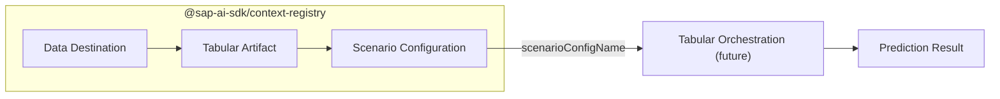

:::important
This package is in **beta** and subject to breaking changes.
Do not use in production.

This package contains generated code, so updates may include breaking changes.
We strongly recommend using the tilde (`~`) version range instead of the caret (`^`) to allow patch updates while preventing potentially breaking minor version changes.
:::

The `@sap-ai-sdk/context-registry` package provides a client for the SAP Context Registry service.
Before you can request predictions from the Tabular Orchestration service, you need to configure three resources in the Context Registry.



The three resources serve the following purposes:

- **Data Destination**: stores the connection details and credentials for an external data store such as HANA Data Lake, Azure Blob Storage, S3, or GCS.
- **Tabular Artifact**: references a file within a Data Destination (for example, a Parquet file) and carries the schema metadata the prediction service needs.
- **Scenario Configuration**: groups one or more Tabular Artifacts under a single name. You pass that name to the Tabular Orchestration service when requesting a prediction.

## Installation

```bash
npm install @sap-ai-sdk/context-registry
```

## Usage

The examples below cover the most common operations for each resource.
You can find additional sample code [here](https://github.com/SAP/ai-sdk-js/blob/main/sample-code/src/tabular-orchestration.ts).

### Data Destinations

Create and delete operations are asynchronous.
The API returns `202 Accepted` with a `Location` header pointing to the new resource.
Poll the `getDataDestinationByName()` method and check `status` until it reaches `ACTIVE`.

#### List Data Destinations

```ts
import type { GetDataDestinations } from '@sap-ai-sdk/context-registry';
// ---cut---
import { DataDestinationsApi } from '@sap-ai-sdk/context-registry';

const response: GetDataDestinations =
  await DataDestinationsApi.getAllDataDestinations(
    {},
    { 'AI-Resource-Group': 'default' }
  ).execute();
```

#### Create or Update a Data Destination

Use the `createUpdateDataDestination()` method to upsert a destination.
Use `executeRaw()` to access the `Location` header for polling.

```ts
import { DataDestinationsApi } from '@sap-ai-sdk/context-registry';
// ---cut---
const response = await DataDestinationsApi.createUpdateDataDestination(
  'my-hdl-destination',
  {
    type: 'HDL',
    connectionConfig: {
      address: 'https://my-hdl-instance.hanacloud.ondemand.com',
      user: 'MY_USER',
      password: 'MY_PASSWORD'
    }
  },
  { 'AI-Resource-Group': 'default' }
).executeRaw();

// response.status === 202
// response.headers.location points to the new resource
```

#### Validate a Data Destination

Use the `validateDataDestination()` method to test provider connectivity before saving.
Nothing is persisted.

```ts
import { DataDestinationsApi } from '@sap-ai-sdk/context-registry';
import type { ValidateDataDestinationResponse } from '@sap-ai-sdk/context-registry';
// ---cut---
const result: ValidateDataDestinationResponse =
  await DataDestinationsApi.validateDataDestination(
    {
      type: 'HDL',
      connectionConfig: {
        address: 'https://my-hdl-instance.hanacloud.ondemand.com',
        user: 'MY_USER',
        password: 'MY_PASSWORD'
      }
    },
    { 'AI-Resource-Group': 'default' }
  ).execute();
```

#### Delete a Data Destination

The API checks for dependent Tabular Artifacts synchronously, then returns `202 Accepted` and marks the destination as `DELETING`.
A background task handles the actual removal.

```ts
import { DataDestinationsApi } from '@sap-ai-sdk/context-registry';
// ---cut---
await DataDestinationsApi.deleteDataDestinationByName(
  'my-hdl-destination',
  { 'AI-Resource-Group': 'default' }
).execute();
```

### Tabular Artifacts

A Tabular Artifact references a file within a Data Destination and carries the schema metadata the prediction service needs.
Creation is asynchronous; poll the `getTabularArtifactByName()` method until `status` is `ACTIVE`.

#### List Tabular Artifacts

```ts
import type { TabularArtifactListResponse } from '@sap-ai-sdk/context-registry';
// ---cut---
import { TabularArtifactsApi } from '@sap-ai-sdk/context-registry';

const response: TabularArtifactListResponse =
  await TabularArtifactsApi.getAllTabularArtifacts(
    {},
    { 'AI-Resource-Group': 'default' }
  ).execute();
```

#### Create a Tabular Artifact

```ts
import { TabularArtifactsApi } from '@sap-ai-sdk/context-registry';
// ---cut---
const response = await TabularArtifactsApi.createTabularArtifact(
  'my-tabular-artifact',
  {
    dataDestinationName: 'my-hdl-destination',
    type: 'PARQUET',
    path: '/data/product_data.parquet',
    csnMetadata: { definition: { definitionType: 'AUTO' } }
  },
  { 'AI-Resource-Group': 'default' }
).executeRaw();

// response.status === 202
// response.headers.location points to the new resource
```

#### Preview Tabular Artifact Data

Use the `getTabularArtifactData()` method to retrieve the first 10 rows of the artifact, which is useful for verifying the data is readable before building a Scenario Configuration.

```ts
import type { TabularArtifactDataPreview } from '@sap-ai-sdk/context-registry';
// ---cut---
import { TabularArtifactsApi } from '@sap-ai-sdk/context-registry';

const preview: TabularArtifactDataPreview =
  await TabularArtifactsApi.getTabularArtifactData(
    'my-tabular-artifact',
    { 'AI-Resource-Group': 'default' }
  ).execute();
```

### Scenario Configurations

A Scenario Configuration groups one or more Tabular Artifacts under a single name.
Pass that name to the Tabular Orchestration service when requesting a prediction.

#### List Scenario Configurations

```ts
import type { GetScenarioConfigurations } from '@sap-ai-sdk/context-registry';
// ---cut---
import { ScenarioConfigurationManagerApi } from '@sap-ai-sdk/context-registry';

const response: GetScenarioConfigurations =
  await ScenarioConfigurationManagerApi.getAllScenarioConfigurations(
    {},
    { 'AI-Resource-Group': 'default' }
  ).execute();
```

#### Create a Scenario Configuration

```ts
import { ScenarioConfigurationManagerApi } from '@sap-ai-sdk/context-registry';
// ---cut---
await ScenarioConfigurationManagerApi.createScenarioConfiguration(
  'my-scenario-config',
  {
    description: 'Product prediction scenario',
    contextSelectionStrategy: 'random',
    tabularArtifacts: [{ name: 'my-tabular-artifact' }]
  },
  { 'AI-Resource-Group': 'default' }
).execute();
```

#### Update a Scenario Configuration

Use the `patchScenarioConfigurationByName()` method to update individual fields without replacing the entire resource.

```ts
import { ScenarioConfigurationManagerApi } from '@sap-ai-sdk/context-registry';
// ---cut---
await ScenarioConfigurationManagerApi.patchScenarioConfigurationByName(
  'my-scenario-config',
  {
    description: 'Updated description',
    tabularArtifacts: [
      { name: 'my-tabular-artifact' },
      { name: 'my-other-artifact' }
    ]
  },
  { 'AI-Resource-Group': 'default' }
).execute();
```

#### Delete a Scenario Configuration

```ts
import { ScenarioConfigurationManagerApi } from '@sap-ai-sdk/context-registry';
// ---cut---
await ScenarioConfigurationManagerApi.deleteScenarioConfigurationByName(
  'my-scenario-config',
  { 'AI-Resource-Group': 'default' }
).execute();
```

### Polling for Async Operations

Create and delete operations return `202 Accepted` and complete in the background.
Poll the corresponding `GET` endpoint and wait until `status` is `ACTIVE` (or `404` for deletions).
The following example polls until a Tabular Artifact is ready:

```ts
import { TabularArtifactsApi } from '@sap-ai-sdk/context-registry';
import type { TabularArtifactDetails } from '@sap-ai-sdk/context-registry';
// ---cut---
async function pollUntilActive(name: string): Promise<TabularArtifactDetails> {
  for (let attempt = 0; attempt < 60; attempt++) {
    const artifact = await TabularArtifactsApi.getTabularArtifactByName(
      name,
      { 'AI-Resource-Group': 'default' }
    ).execute();

    if (artifact.status === 'ACTIVE') {
      return artifact;
    }
    if (artifact.status === 'ERROR') {
      throw new Error(artifact.errorMessage ?? 'Tabular artifact creation failed');
    }

    await new Promise(resolve => setTimeout(resolve, 2000));
  }
  throw new Error('Timed out waiting for tabular artifact to become active');
}
```

The same pattern applies to Data Destinations and Scenario Configurations.

## Custom Destination

Pass a `destinationName` to the `execute()` method to target a specific SAP AI Core instance.

```ts
import { DataDestinationsApi } from '@sap-ai-sdk/context-registry';
// ---cut---
const response = await DataDestinationsApi.getAllDataDestinations(
  {},
  { 'AI-Resource-Group': 'default' }
).execute({ destinationName: 'my-destination' });
```

By default, the fetched destination is cached.
To disable caching, set `useCache` to `false` together with `destinationName`.

For more information about configuring a destination, refer to the [Using a Destination](../connecting-to-ai-core.mdx#using-a-destination) section.

## Custom Request Configuration

Pass request configuration as a second argument to the `execute()` method.

```ts
import { DataDestinationsApi } from '@sap-ai-sdk/context-registry';
// ---cut---
const response = await DataDestinationsApi.getAllDataDestinations(
  {},
  { 'AI-Resource-Group': 'default' }
).execute(undefined, {
  headers: {
    'x-custom-header': 'custom-value'
  }
});
```
