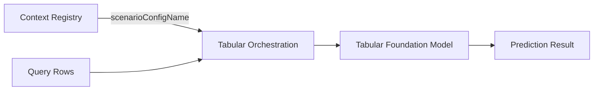

:::important
This package is in **beta** and subject to breaking changes.
Do not use it in production.

This package contains generated code, so updates may include breaking changes.
We strongly recommend using the tilde (`~`) version range instead of the caret (`^`) to allow patch updates while preventing potentially breaking minor version changes.
:::

The `@sap-ai-sdk/tabular-orchestration` package provides a client for making predictions with Tabular Foundation Models through the SAP AI Core Tabular AI Orchestration service.
The service can select prediction context from tabular artifacts managed in the [Context Registry](./context-registry.mdx), or you can provide context directly in the request.



## Installation

```bash
npm install @sap-ai-sdk/tabular-orchestration
```

## Prerequisites

Deploy the `tabular-orchestration` scenario in SAP AI Core.
To select context from stored data, also create a Data Destination, Tabular Artifact, and Scenario Configuration as described in the [Context Registry documentation](./context-registry.mdx).

## Client Initialization

Create a `TabularOrchestrationClient` instance.
Without arguments, the client resolves a running `tabular-orchestration` deployment in the `default` resource group:

```ts twoslash
import { TabularOrchestrationClient } from '@sap-ai-sdk/tabular-orchestration';

const client = new TabularOrchestrationClient();
```

To use a different resource group, pass its name to the constructor:

```ts twoslash
import { TabularOrchestrationClient } from '@sap-ai-sdk/tabular-orchestration';

const client = new TabularOrchestrationClient({
  resourceGroup: 'my-resource-group'
});
```

## Predict With Context Registry Data

Pass the name of a Scenario Configuration in the `scenarioConfigName` property.
The service uses the Scenario Configuration and the `contextSelectionConfig` object to select context rows from its Tabular Artifacts:

```ts twoslash
import { TabularOrchestrationClient } from '@sap-ai-sdk/tabular-orchestration';

const client = new TabularOrchestrationClient();

const { predictions, metadata, status } = await client.predict({
  modelName: 'sap-rpt-1.6',
  scenarioConfigName: 'my-scenario-config',
  contextSelectionConfig: {
    strategy: 'random',
    numRows: 100,
    indexColumn: 'id',
    strategyConfig: { deterministic: true }
  },
  predictionConfig: {
    targetColumns: [
      {
        name: 'salesgroup',
        prediction_placeholder: '[PREDICT]',
        task_type: 'classification'
      }
    ]
  },
  modelConfig: { index_column: 'id' },
  rows: [
    {
      id: '42',
      product: 'Desktop Computer',
      salesgroup: '[PREDICT]'
    }
  ]
});
```

The request contains the following main properties:

- `modelName`: Selects the Tabular Foundation Model.
- `scenarioConfigName`: Identifies the Scenario Configuration from the Context Registry.
- `contextSelectionConfig`: Controls how many context rows the service selects and which selection strategy it uses.
- `predictionConfig`: Defines the target columns and the cells to predict.
- `modelConfig`: Passes model-specific options to the selected model.
- `rows` or `columns`: Provides the query data in row-wise or column-wise form.

The response contains the prediction request ID, status, selected metadata, and a `predictions` array.
If you set `modelConfig.index_column`, each prediction contains the corresponding index value from the query row.

## Predict With Inline Context

Omit `scenarioConfigName` when you provide context directly in the request.
Use `contextRows` with row-wise query data, or use `contextColumns` with column-wise query data:

```ts twoslash
import { TabularOrchestrationClient } from '@sap-ai-sdk/tabular-orchestration';

const client = new TabularOrchestrationClient();

const response = await client.predict({
  modelName: 'sap-rpt-1.6',
  predictionConfig: {
    targetColumns: [
      {
        name: 'salesgroup',
        task_type: 'classification'
      }
    ]
  },
  modelConfig: { index_column: 'id' },
  contextRows: [
    { id: '1', product: 'Laptop', salesgroup: 'Portable Computers' },
    { id: '2', product: 'Monitor', salesgroup: 'Displays' }
  ],
  rows: [
    {
      id: '42',
      product: 'Desktop Computer',
      salesgroup: '[PREDICT]'
    }
  ]
});
```

## Configure a Model

The `modelName` value determines the TypeScript type of `modelConfig`.
For example, `sap-rpt-1.6-large` supports the `context_mode` property, while other model configurations expose only the properties supported by their generated schemas.

Use the `ModelConfigFor` type when you define a model configuration separately:

```ts twoslash
import type { ModelConfigFor } from '@sap-ai-sdk/tabular-orchestration';

const modelConfig: ModelConfigFor<'sap-rpt-1.6-large'> = {
  index_column: 'id',
  parse_data_types: true,
  prediction_config: {
    context_mode: 'deep'
  }
};
```

Model-specific properties use the field names of the underlying model API, such as `index_column`, `parse_data_types`, and `prediction_config`.

## Specify a Deployment

Pass a deployment ID to skip automatic deployment resolution.
Set the resource group that contains the deployment when it differs from `default`:

```ts twoslash
import { TabularOrchestrationClient } from '@sap-ai-sdk/tabular-orchestration';

const client = new TabularOrchestrationClient({
  deploymentId: 'MY_DEPLOYMENT_ID',
  resourceGroup: 'my-resource-group'
});
```

## Custom Destination

Pass a destination as the second constructor argument to target a specific SAP AI Core instance:

```ts twoslash
import { TabularOrchestrationClient } from '@sap-ai-sdk/tabular-orchestration';

const client = new TabularOrchestrationClient(
  { resourceGroup: 'default' },
  { destinationName: 'my-destination' }
);
```

By default, the fetched destination is cached.
To disable caching, set `useCache` to `false` together with `destinationName`.
For more information about configuring a destination, refer to the [Using a Destination](../connecting-to-ai-core.mdx#using-a-destination) section.

## Custom Request Configuration

Pass custom request configuration as the second argument to the `predict()` method:

```ts twoslash
import { TabularOrchestrationClient } from '@sap-ai-sdk/tabular-orchestration';
import type { PredictRequest } from '@sap-ai-sdk/tabular-orchestration';

const client = new TabularOrchestrationClient();
const request: PredictRequest = {
  modelName: 'sap-rpt-1.6',
  predictionConfig: {
    targetColumns: [{ name: 'salesgroup' }]
  },
  modelConfig: {},
  contextRows: [{ product: 'Laptop', salesgroup: 'Portable Computers' }],
  rows: [{ product: 'Desktop Computer', salesgroup: '[PREDICT]' }]
};

const response = await client.predict(request, {
  headers: {
    'x-custom-header': 'custom-value'
  }
});
```
